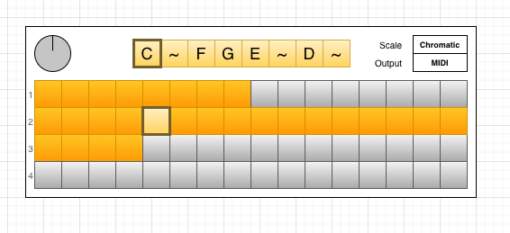

# jamcity
Run TidalCycles and SuperCollider from the command line.

### Prerequisites

- [TidalCycles/SuperCollider](https://tidalcycles.org/index.php/Installation)
- [Haskell platform](https://www.haskell.org/platform/)
- Ruby >= 2.4

### MIDI:

Configure your midi device in `superdirt_startup.scd`. Run `bin/super_collider` to see list of available devices.

### Start SuperCollider:
```
bin/super_collider
```

### Run TidalCycles:
```
bin/tidal_cycles
```

### Test sound:
```
d1 $ sound "bd*2 cp"
```

### Roadmap:

- Creating a GUI sequencer



### Helpful resources:

- https://tidalcycles.org/index.php/Tutorial
- https://tidalcycles.org/index.php/Mini_notation_syntax
- https://tidalcycles.org/index.php/Building_up_patterns
- https://tidalcycles.org/index.php/All_effects_and_synths